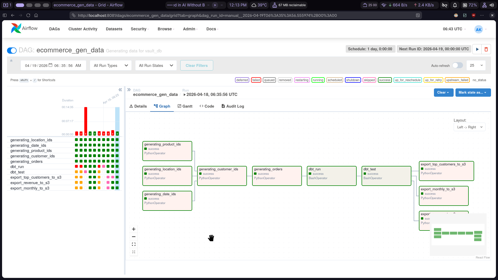
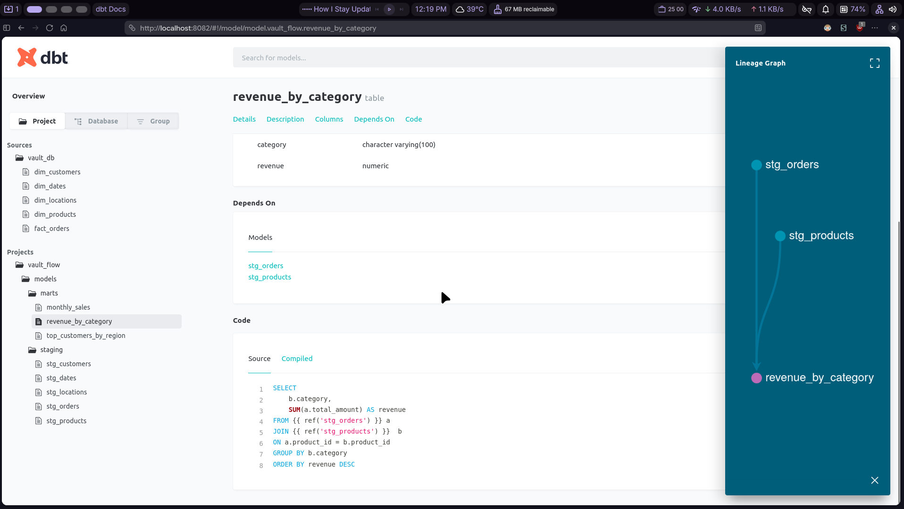

# VaultFlow

VaultFlow is an end-to-end retail data engineering project using PostgreSQL, dbt, Airflow, and AWS S3.

## Architecture

`Synthetic Data -> PostgreSQL (Star Schema) -> dbt (Staging + Marts) -> Airflow Orchestration -> S3 Data Lake`

## Tech Stack

- Python 3.13
- PostgreSQL 15
- Apache Airflow 2.9.3 (CeleryExecutor + Redis)
- dbt-postgres
- Docker + Docker Compose
- AWS S3 (Parquet export)

## Project Structure

```text
.
├── dags/                 # Airflow DAG(s)
├── dbt/                  # dbt project (staging + marts models)
├── demo/                 # Demo screenshots
├── docker/               # Dockerfile + docker-compose + pgAdmin server config template
├── scripts/              # Data generators, loaders, pipeline tasks, S3 export logic
├── sql/                  # Database bootstrap schema
├── pyproject.toml        # Python dependencies (uv/pip)
└── README.md
```

## Data Model

- Fact table: `fact_orders`
- Dimension tables: `dim_customers`, `dim_products`, `dim_dates`, `dim_locations`
- dbt marts: `monthly_sales`, `revenue_by_category`, `top_customers_by_region`

## Pipeline Flow

The Airflow DAG `ecommerce_gen_data` runs daily:

1. Generate and load dimensions (`locations`, `dates`, `products`)
2. Generate and load `customers`
3. Generate and load `orders`
4. Run `dbt run`
5. Run `dbt test`
6. Export marts to S3 as Parquet

S3 output path pattern:

`lake/{dataset}/year=YYYY/month=MM/day=DD/{dataset}.parquet`

## Prerequisites

- Docker + Docker Compose
- Python 3.13
- `uv` (recommended) or `pip`
- AWS credentials with S3 write access (for export tasks)

## Setup

1. Clone the repository and move into it.
2. Create required config files:

```bash
cp .env.example .env
cp docker/servers.json.example docker/servers.json
cp dbt/profiles.yml.example dbt/profiles.yml
```

3. Update `.env` with all required keys:

```bash
# Postgres
DB_HOST=postgres
DB_PORT=5432
DB_NAME=vault_db
DB_USER=your_user
DB_PASSWORD=your_password

# pgAdmin
PGADMIN_DEFAULT_EMAIL=admin@admin.com
PGADMIN_DEFAULT_PASSWORD=your_password

# Airflow metadata DB + admin user
AIRFLOW_DB=airflow
AIRFLOW_USER=airflow
AIRFLOW_PASSWORD=your_password
AIRFLOW_FIRSTNAME=Admin
AIRFLOW_LASTNAME=User
AIRFLOW_EMAIL=admin@admin.com
AIRFLOW_FERNET_KEY=your_fernet_key
AIRFLOW_SECRET_KEY=your_secret_key

# AWS
AWS_ACCESS_KEY_ID=your_access_key
AWS_SECRET_ACCESS_KEY=your_secret_key
AWS_REGION=ap-south-1
S3_BUCKET_NAME=your_bucket_name
```

## Run With Docker

Start all services:

```bash
docker compose -f docker/docker-compose.yml --env-file .env up -d
```

Useful URLs:

- Airflow: `http://localhost:8081`
- pgAdmin: `http://localhost:8080`

## Local dbt Commands (Optional)

Use local target from `dbt/profiles.yml` (`localhost:5433`):

```bash
uv venv
source .venv/bin/activate
uv sync

uv run dbt run --project-dir dbt --profiles-dir dbt --target local
uv run dbt test --project-dir dbt --profiles-dir dbt --target local
```

dbt docs:

```bash
uv run dbt docs generate --project-dir dbt --profiles-dir dbt --target local
uv run dbt docs serve --project-dir dbt --profiles-dir dbt --port 8082
```

Then open `http://localhost:8082`.

## Demo

### Airflow DAG Run



### dbt Model Docs




